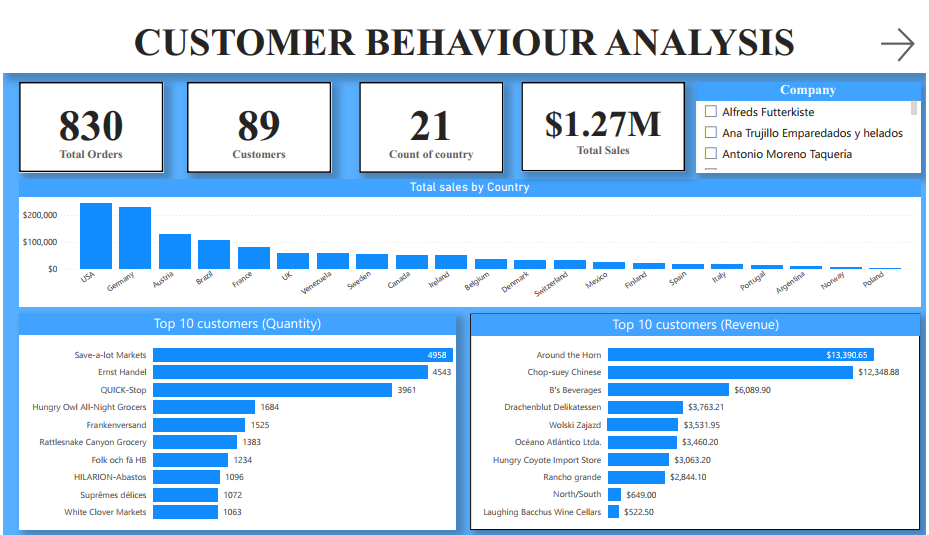
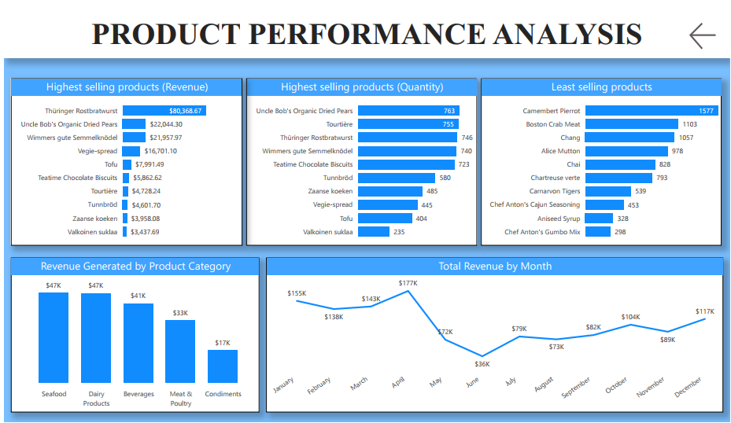

# Northwind_Traders

Analysis of Northwind traders dataset to see how sales can be improved.

## Introduction
In this project, I apply the Power BI skills I have learnt over the past week, by documenting my analysis of Northwind Traders dataset that the organization I am learning from has provided. This project aims to assess how well the company is doing in terms of the services provided to its customers and to gain insights into how the customers perceive the business.

## Problem Statement
Northwind Traders, a company known for distributing gourmet food products, wants to make its operations better and decisions smarter in the 2nd half of 2015. To achieve this, the company plans to study its sales data, how customers behave, and how well its products are doing with emphasis on the 1st half of 2015. By doing this, Northwind Traders hopes to find important insights and ways to grow even more.
In their analysis, Northwind Traders wants to look closely at sales trends, how customers buy things, and which products are selling well based on what was achieved in the 1st half of 2015. They believe that by understanding these things better, they can make smarter choices about what to sell and how to sell it. This means they can make sure they have the right products in stock and keep their customers happy.
Northwind Traders knows that using data to make decisions is important. They want to use this information to find ways to make their business better and keep up with what their customers want.

## Tools, Skills and Concepts used
- Microsoft Power BI
- Connecting the data to Power BI
- Data exploration to understand the columns
- Data Manipulation and Transformation (DAX included)
- Dashboard Building

## Data Source
The data was provided for ease. But it can be gotten from the data folder in the repository

## Data Visualisation

### Key Insights
1. Which countries contribute the most to the overall sales?
 - The top contributing countries to overall sales are USA, Germany, and Austria. The USA leads with the highest sales figures, followed by Germany and Austria, indicating that these 
   markets are key drivers of revenue for Northwind Traders.

2. Who are the top customers by quantity and revenue, and what does this suggest about customer loyalty?
- Top Customers by Quantity:
  Save-a-lot Markets (4,958 units)
  Ernst Handel (4,543 units)
- Top Customers by Revenue:
  Around the Horn ($13,390.65)
  Chop-suey Chinese ($12,348.88)

The fact that certain customers like Save-a-lot Markets and Ernst Handel appear in the top for both quantity and revenue suggests they are highly engaged and potentially very loyal. They likely contribute significantly to recurring sales.

3. What are the highest and least selling products, and what trends can be observed?
- Highest Selling Products (Revenue): Thüringer Rostbratwurst leads with $80,368.67 in revenue.
- Highest Selling Products (Quantity): Uncle Bob’s Organic Dried Pears tops the list with 763 units sold.
- Least Selling Products: Camembert Pierrot and Boston Crab Meat are among the least selling products, with only 1577 and 1103 units sold, respectively.

These trends suggest that while some products are top performers in both revenue and quantity, others like Camembert Pierrot and Boston Crab Meat might require re-evaluation in terms of their market strategy or even potential discontinuation.

4. Which product categories generate the most revenue, and how does revenue fluctuate over the months?
- Top Product Categories: Seafood and Dairy Products both generate the highest revenue, around $47K each.
- Revenue by Month: The revenue shows a significant peak in April with $177K, followed by a slight decline, and then another rise in May. The fluctuation indicates potential seasonality 
  in sales, with April being a peak month.

Understanding these patterns can help in inventory management and promotional planning to capitalize on peak sales periods.

5. Which customers or regions might be targeted for growth based on the current data?
- Regions like UK, France, and Italy show lower sales compared to the top-performing countries. This suggests potential for targeted marketing or sales efforts to grow these markets.
  Additionally, customers who are purchasing in lower quantities but are still generating significant revenue could be targeted for loyalty programs to encourage higher purchase volumes.

6. How does the revenue distribution among product categories inform inventory and sales strategies?
- The revenue distribution shows that Seafood and Dairy Products are leading categories. This insight indicates that these categories should be prioritized in inventory management to 
  avoid stockouts. Lower-performing categories, such as Condiments (with $17K), might require a different sales strategy or promotional efforts to increase their sales.

7. Are there specific products that consistently perform well or poorly, and what actions should be taken?
- Products like Thüringer Rostbratwurst consistently perform well, indicating strong market demand. In contrast, products such as Camembert Pierrot have poor sales, suggesting they might 
  either be less popular or face distribution challenges. Actions could include increasing marketing efforts for underperforming products or reconsidering their place in the product 
  lineup.

### What makes customers keep coming back, and how can Northwind Traders use this to get more loyal customers?
The "Top 10 Customers (Quantity)" and "Top 10 Customers (Revenue)" charts provide insights into repeat customers. Customers like Save-a-lot Markets and Ernst Handel are purchasing frequently and in large quantities.
The consistency in orders from these top customers indicates satisfaction with product availability, pricing, and service quality. Northwind Traders can foster more loyalty by doing the following:
- Offering personalized discounts or loyalty programs to these frequent buyers.
- Ensuring consistent product quality and availability.
- Engaging with these customers directly through targeted marketing campaigns to understand their needs and preferences better.

### Are there certain products that are selling faster than others, and how can Northwind Traders make sure they always have enough of these in stock?
The "Highest Selling Products (Quantity)" and "Highest Selling Products (Revenue)" charts highlight the fastest-moving products, like Uncle Bob’s Organic Dried Pears and Thüringer Rostbratwurst.
These products are in high demand, and Northwind Traders should:
- Monitor inventory levels closely to avoid stockouts, especially for these high-demand items.
- Establish strong supplier relationships to ensure quick restocking of these popular items.

### Do different types of customers buy different things, and how can Northwind Traders use this information to offer products that people want?
The variation in product preferences among different customers can be inferred from the customer and product performance charts.
By examining which products are being purchased by the top customers, Northwind Traders can identify patterns in buying behavior. For example:
If Chop-suey Chinese is purchasing more from the "Seafood" and "Dairy Products" categories, Northwind Traders can tailor promotions or special offers to similar customers, emphasizing those categories.
